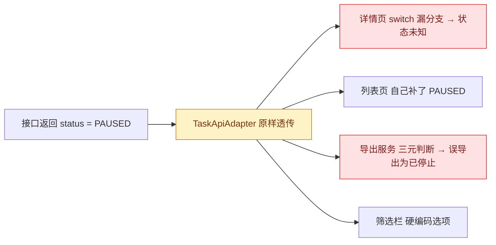

# Change Locality Analysis

Use this during Phase 3 (diagnosis and solution design) and Phase 4 (diff check). It answers one question: **is the variation that caused this bug contained at the boundary that should own it, or has it leaked so that many receivers each guess, convert, and check it on their own?**

Locality decides **where** the fix belongs. It does not license a refactor. The fix stays minimal and coherent; locality only tells you which minimal fix is the right one.

## Core idea

Changing one input path should, in theory, affect only a few modules. If a change on that path forces many receivers to each add their own guess, conversion, or check, the structure has not closed the variation where it should be closed. Bugs in that situation are rarely one-off mistakes; they are the receiver that was forgotten this time.

Three terms are used throughout:

| Term | Meaning | Typical examples |
|------|---------|------------------|
| **Variation (变化点)** | The thing that differs between the working case and the failing case. | A new enum value, an optional field that is now `null`, a date string in a second format, a request arriving through a second route, an ID that may be a number or a string. |
| **Owner boundary (归属边界)** | The single place where the variation enters the system and should be normalized, so that everything downstream sees one shape. | API adapter, DTO mapper, parser, deserializer, repository layer, a domain constructor, a state machine. |
| **Receiver (接收方)** | Any code that consumes the value after the boundary and has to know about the variation to work correctly. | Page components, formatters, exporters, validators, reducers, templates, SQL builders. |

A variation is **contained (已关住)** when exactly one owner handles it and receivers never need to know it existed. It is **leaked (已泄漏)** when two or more receivers each contain their own handling of the same variation.

## Procedure

### Step 1: Name the variation precisely

Write one sentence of the form: "在正常情况下 X 是 A；在这个 bug 的情况下 X 是 B。" Use the concrete values from the reproduction. If you cannot fill this sentence in, you have not finished the root-cause analysis yet.

Examples:

- 正常情况下 `status` 是 `RUNNING` / `STOPPED`；这个 bug 里 `status` 是新增的 `PAUSED`。
- 正常情况下接口返回 `createdAt: "2024-01-01"`；这个 bug 里返回 `createdAt: "2024-01-01T08:00:00+08:00"`。
- 正常情况下用户从列表页进入详情页，路由带 `?tab=basic`；这个 bug 里用户从通知链接直达，`tab` 参数缺失。

### Step 2: Find the owner boundary

Trace the variation upstream to the first place inside the codebase where it appears: the adapter that receives the response, the parser that reads the file, the reducer that stores the state, the constructor that builds the entity. That is the candidate owner. Ask:

- Does this place already normalize other variations of the same value? If yes, it is almost certainly the owner and this variation was simply not added.
- Does this place pass the raw value through untouched? If yes, the variation currently has no owner; every receiver is exposed to it.

### Step 3: Enumerate the receivers

Search the codebase for every consumer of the value. Use the actual identifiers (field name, enum type, route parameter, event name) and grep for them, then for the literal values and for conversions (`parse`, `format`, `split`, `toString`, `switch`, ternaries on the value). Record each receiver as one of:

- **Handles it** — contains its own guess, conversion, or check for the variation.
- **Missed it** — consumes the value assuming the old shape; this is usually where the reported symptom appears.
- **Indifferent** — passes the value through or does not depend on the shape.

Count the first two categories. When dynamic dispatch, reflection, or generated code makes the search incomplete, say so and treat the count as a lower bound.

### Step 4: Give the verdict

| Owner handles it? | Receivers handling it on their own | Verdict | What the bug really is |
|-------------------|------------------------------------|---------|------------------------|
| Yes | 0 | `已关住` | A genuine one-off mistake inside or right after the owner. Fix there. |
| No | 1 (the missed one) | `已关住`, one gap | The variation is new and nobody handles it yet. Handle it once, at the owner. |
| No | 2 or more | `已泄漏` | Systemic. The reported receiver is the one someone forgot this time; other receivers may be silently wrong or duplicating logic. |
| Partially | mixed | `部分泄漏` | Owner normalizes some cases; receivers compensate for the rest. Usually a sign the owner was extended piecemeal. |

Write the verdict as one plain sentence in the packet, for example: "`status` 的取值变化没有被关在接口适配层，现在 5 个页面各自写了一份 `switch`，这次报的详情页只是漏掉的那一个。"

### Step 5: Choose where to fix

Present the two candidate fixes side by side and pick one with a stated reason:

| Option | When to prefer | Cost to note |
|--------|----------------|--------------|
| **Boundary fix (边界修复)** — normalize the variation once at the owner so receivers see one shape. | The owner already exists or is obvious; the change is small; receivers that handle it themselves can be left alone for now or simplified trivially. | Wider blast radius: every receiver now gets the normalized shape. Confirm none of them relied on the raw shape. |
| **Local patch (局部修复)** — add the missing handling to the receiver that broke. | Delivery pressure; the owner does not exist and creating one is not small; the receiver's need is genuinely unique. | The leak remains. Record it as a structural signal in `风险` so it is visible, and do not present the patch as if the class of bug is gone. |

Never pick a third option that edits several receivers for the same reason. If the only minimal-looking fix touches many receivers with near-identical changes, that is the leak showing itself; move to the boundary fix or stop and discuss.

### Step 6: State the locality budget

In the solution section, write:

- **理论影响面**: which modules a change on this input path should touch (usually the owner and its tests).
- **实际触及文件**: the files the proposal edits.
- **其中接收方自行加判断的**: count and list. Zero is the target for a boundary fix; one is acceptable for a local patch.

During Phase 4, compare the real diff against this budget. Spreading beyond it means the plan was wrong; stop and report rather than continuing.

## Worked example

**JIRA report**: 任务详情页在任务被暂停后显示“状态未知”。

**Step 1 — variation**: 正常情况下任务 `status` 是 `RUNNING` 或 `STOPPED`；这个 bug 里后端在 2.3 版本新增了 `PAUSED`。

**Step 2 — owner**: `TaskApiAdapter.toTask()` 把接口 JSON 转成前端 `Task` 对象。它把 `status` 原样透传，没有任何映射；变化点当前没有归属。

**Step 3 — receivers** (grep `task.status`, `TaskStatus`, `'RUNNING'`, `'STOPPED'`):

| 位置 | 类别 | 说明 |
|------|------|------|
| `TaskDetailPage.statusLabel()` | Missed it | `switch` 只有两个分支，默认返回“状态未知” —— 就是这次的症状 |
| `TaskListRow.statusBadge()` | Handles it | 已经有人加了 `case 'PAUSED'` |
| `TaskExportService.rowFor()` | Handles it | 用 `status === 'RUNNING' ? '运行中' : '已停止'`，`PAUSED` 会被导出成“已停止”—— 静默错误 |
| `TaskFilterBar.options` | Handles it | 硬编码了三个选项 |
| `TaskMonitorWidget` | Indifferent | 只判断 `status !== 'STOPPED'` |

**Step 4 — verdict**: `已泄漏`。三个接收方各自维护一份状态语义，一个漏掉，一个静默出错。

**Step 5 — where to fix**: 边界修复。在 `TaskApiAdapter.toTask()` 中把接口字符串映射成前端枚举 `TaskStatus`，并在同一处提供 `TaskStatus.label()`。接收方改为调用 `label()`；这次只改详情页和导出服务这两个受影响的接收方，列表页已正确、筛选栏另开单。

**Step 6 — budget**:

- 理论影响面：`TaskApiAdapter`、`TaskStatus`、它们的测试。
- 实际触及文件：`TaskApiAdapter.ts`、`TaskStatus.ts`、`TaskDetailPage.ts`、`TaskExportService.ts` 及测试。
- 其中接收方自行加判断的：0（两个接收方是删掉自己的判断改为调用 `label()`，不是新增判断）。

## Anti-patterns to avoid

- **Refactor disguised as locality**: rewriting the owner, introducing a new abstraction layer, or touching receivers that are not part of the reported failure. Keep the change to what the verdict requires.
- **Patching every receiver**: fixing the bug by adding the same `case` to five files. This is the leak reproducing itself in the diff.
- **Declaring `已关住` without searching**: the verdict must be backed by the receiver list, not by intuition.
- **Hiding the leak**: choosing the local patch is acceptable; choosing it and not recording the structural signal is not.
