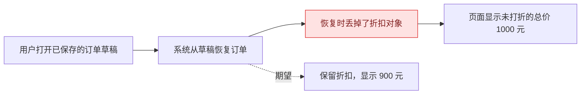
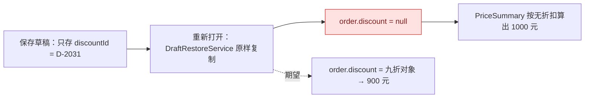
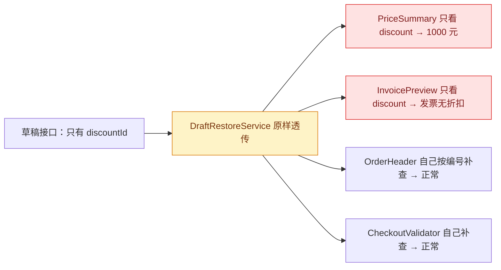

# Review Packet Guide

How to write the Phase 3 approval packet and the Phase 5 commit-approval packet so that a reader who has never opened the code understands what broke, why, and what will change. Pair this with `change-locality.md` for the locality sections.

## Who the reader is

Write for a product owner or tester who knows the business flow but not the code, while keeping enough evidence that a reviewer who does know the code can verify every claim. The first screen must let the non-coder decide; the detailed evidence below must let the coder check.

## Writing rules

1. **Business language first.** Say what the user did and what the system did to their data. Introduce a class, function, field, or file name only when it pins down the cause, and gloss it the first time: "`DraftRestoreService`（把草稿恢复成订单的那段代码）".
2. **One concrete example, reused everywhere.** Pick the failing case from the reproduction with its real values. The reproduction chain shows it failing, the root cause explains why, the solution shows the same input producing the right result. Do not switch examples mid-packet.
3. **Walk `情境 → 系统做了什么 → 为什么得到这个结果`.** Every explanatory paragraph follows this shape. State the concrete value at each step ("此时 `order.discount` 是 `null`，而 `order.discountId` 是 `D-2031`") so the reader can see the state go wrong rather than being told it did.
4. **Specific subject and verb.** "折扣恢复代码没有把折扣编号换回折扣对象" rather than "折扣处理存在问题". Avoid passive voice and nominalizations that hide who did what.
5. **Keep conditions, causality, and uncertainty.** If a step is inferred rather than observed, say "推断" and say what would confirm it. Plain language is not permission to overstate.
6. **Cause, not symptom.** Name the point where state first becomes wrong. Everything downstream of that point is a symptom and belongs in the reproduction chain, not the root-cause sentence.
7. **Short first, detail later.** Each section opens with its one-sentence version, then the example, then the evidence. Raw commands, logs, and stack traces go in the appendix.

## Section-by-section requirements

### Review 结论

One paragraph, three to five sentences:

- classification: bug / 实现偏差 / 配置或数据问题 / 尚未证实;
- user-visible impact in one clause;
- the causal fault in business terms;
- the locality verdict in one clause (`已关住` / `已泄漏`);
- the recommended smallest coherent action.

### 1. 业务复现链路

- starting state and actor with concrete data;
- exact user actions or inputs;
- system steps as a causal chain (this happened, therefore that happened);
- expected result and actual result, side by side;
- stable reproduction evidence: the command or path used and the 2+ matching runs.

Optional Mermaid when the chain crosses modules or branches between expected and actual.

### 2. 问题根因总结

Three labelled parts, in order:

- **一句话根因** — what the system misunderstood or skipped, in business terms.
- **用例子讲清楚** — rerun the example step by step; at each step give the concrete value; stop at the exact point where the value becomes wrong and explain why the code makes that choice. Then: responsible code path, decisive evidence (a line, a log, a test output), cause versus symptom, and alternatives ruled out with the evidence that ruled them out.
- **变化的局部性** — variation sentence, owner boundary, receiver table (handles / missed / indifferent), verdict sentence. See `change-locality.md` Steps 1–4.

### 3. 推荐解决方案

Four labelled parts, in order:

- **一句话方案** — what will change, in business terms.
- **修复后的同一个例子** — same input, new intermediate value, correct output.
- **局部性检查** — 理论影响面 / 实际触及文件 / 其中接收方自行加判断的数量, plus the chosen option (边界修复 or 局部修复) and why. If a leak is left in place, name it as a structural signal.
- **落地细节** — affected files or boundaries; why the change removes the cause; focused test plan (the regression test expresses the example); compatibility and operational risks; rejected alternatives with brief reasons.

### 附录：证据

Commands, output excerpts, stack traces, `git blame` lines, grep results used for the receiver table. Redact secrets.

## Mermaid guidance

Use a diagram when it materially clarifies a chain with three or more dependent steps, crosses modules or actors, branches between expected and actual, or depends on state or timing. Skip it for simple issues.

- `flowchart LR` for a business or data-flow chain; `sequenceDiagram` for actor or request ordering; `stateDiagram-v2` for lifecycle or timing defects.
- A **locality diagram** — one source node fanning out into several receiver nodes, with the missed and silently-wrong receivers highlighted — is usually the clearest way to show a leak. Use it in `变化的局部性` when the verdict is `已泄漏`.
- Plain business labels; add code identifiers only where they establish the cause. Mark the failure point visually. Draw only evidence-backed steps.
- One focused diagram per packet by default; a second only when the business path and the code path are genuinely different.

Business-chain example:



## Complete worked example (Phase 3 packet)

The following is a full packet for a fictional issue. Match its shape, not its wording.

---

**WARP-20831 · 已保存订单草稿重新打开后总价不含折扣**

### Review 结论

这是一个 bug。用户把带折扣的订单保存为草稿后再打开，页面总价按原价显示，折扣消失。原因是"草稿恢复"这条输入路径只带回了折扣编号，没有把它换回折扣对象，而总价计算只认折扣对象。折扣这个变化点没有被关在草稿恢复层，目前有四处页面代码各自处理"有编号没对象"的情况，两处处理了、两处漏了，属于 `已泄漏`。建议在草稿恢复层统一把折扣编号还原为折扣对象（边界修复），改动集中在一处，并顺带修正同样漏掉的发票预览。

### 1. 业务复现链路

**起点**：销售员 A 在新建订单页添加商品"服务器 ×1，单价 1000 元"，选择折扣 `D-2031`（九折），页面显示总价 900 元，点击"保存草稿"。

**操作**：A 关闭页面，从"我的草稿"列表重新打开这张订单。

**系统步骤**：

1. 页面调用草稿接口 `GET /drafts/{id}`，接口返回订单 JSON，其中有 `discountId: "D-2031"`，没有 `discount` 对象（草稿只保存编号，这是后端设计）。
2. `DraftRestoreService`（把草稿 JSON 变成前端订单对象的代码）把字段原样复制，得到 `order.discountId = "D-2031"`、`order.discount = null`。
3. `PriceSummary`（算总价的组件）读取 `order.discount`，发现是 `null`，按"无折扣"计算。

**期望**：总价 900 元，折扣标签显示"九折"。
**实际**：总价 1000 元；订单头部的折扣标签却显示"九折"（头部组件自己用编号查了一次）。

**复现证据**：Playwright 用例 `draft-restore.spec.ts` 手动执行两次，均在同一断言失败（`expected 900, received 1000`）；接口响应体两次一致。详见附录 A。



### 2. 问题根因总结

**一句话根因**：草稿恢复时，系统只拿回了折扣的"编号"，没有把它换回总价计算需要的"折扣对象"，于是总价把它当成没有折扣。

**用例子讲清楚**：

- 情境：草稿接口返回 `{ items: [...], discountId: "D-2031" }`。
- 系统做了什么：`DraftRestoreService.restore()` 第 42 行做的是逐字段拷贝 `Object.assign(new Order(), json)`。拷贝后 `order.discountId === "D-2031"`，但 `order.discount === null`，因为 JSON 里根本没有 `discount` 字段。
- 为什么得到这个结果：`PriceSummary.total()` 第 18 行写的是 `const rate = order.discount?.rate ?? 1`。它只看 `discount` 对象，从不看 `discountId`。`null?.rate` 是 `undefined`，于是 `rate = 1`，总价 = 1000。

**责任代码与决定性证据**：`DraftRestoreService.restore()`（`src/order/draft-restore.service.ts:42`）没有还原 `discount`；在该行之后打断点观察到 `order.discount === null`。新建订单路径不经过这段代码，`discount` 由前端选择器直接赋值，所以新建时正常。

**因与果**：`PriceSummary` 显示 1000 元是症状；`discount` 在恢复时丢失是因。

**排除的其他假设**：
- "后端草稿接口漏存折扣"——排除：接口响应含 `discountId: "D-2031"`，编号未丢；且接口文档从 1.0 起就只存编号。
- "PriceSummary 计算逻辑本身错"——排除：新建订单路径下同一组件显示 900 元。
- "缓存返回旧数据"——排除：两次复现均清空存储后进行，响应体带最新 `updatedAt`。

**变化的局部性**：

- 变化点：正常情况下（新建路径）订单带 `discount` 对象；这个 bug 里（草稿恢复路径）订单只带 `discountId` 字符串。
- 归属边界：`DraftRestoreService.restore()` 是草稿路径进入前端的唯一入口，应该在这里把编号还原为对象。目前它原样透传，变化点没有归属。
- 接收方（grep `discountId`、`discount?.`、`lookupDiscount`）：

| 位置 | 类别 | 说明 |
|------|------|------|
| `PriceSummary.total()` | 漏掉 | 只看 `discount` —— 本次症状 |
| `InvoicePreview.render()` | 漏掉 | 同样只看 `discount`，发票预览也不含折扣，用户尚未上报 |
| `OrderHeader.discountBadge()` | 自行处理 | `order.discount ?? lookupDiscount(order.discountId)` —— 所以标签显示正常 |
| `CheckoutValidator.validate()` | 自行处理 | `if (!order.discount && order.discountId) { ... }` 自己补查 |
| `OrderItemTable` | 无关 | 不依赖折扣 |

- 判定：`已泄漏`。四个接收方里两个各自补查、两个漏掉。这次报的总价只是漏掉的其中一个；发票预览有同样问题但静默。



### 3. 推荐解决方案

**一句话方案**：让草稿恢复这一步就把折扣编号换回折扣对象，之后所有页面拿到的订单都和新建时长得一样，不需要各自再猜。

**修复后的同一个例子**：接口仍返回 `discountId: "D-2031"`；`DraftRestoreService.restore()` 拷贝后追加一步 `order.discount = await discountRepo.byId(json.discountId)`，得到 `order.discount = { id: "D-2031", rate: 0.9 }`；`PriceSummary.total()` 读到 `rate = 0.9`，显示 900 元；发票预览同时恢复正常。

**局部性检查**：

- 理论影响面：`DraftRestoreService` 及其测试。
- 实际触及文件：`draft-restore.service.ts`、`draft-restore.service.spec.ts`。
- 其中接收方自行加判断的：0。`PriceSummary` 和 `InvoicePreview` 不需要改；`OrderHeader` 和 `CheckoutValidator` 里的自行补查会变成永远走不到的分支，本次不删（避免扩大改动），在风险中记录为可清理项。
- 选择：边界修复。改动只在归属边界，一次修好两处症状，并让后续新页面不再需要知道草稿路径的差异。

**落地细节**：

- 改动文件：`src/order/draft-restore.service.ts`（`restore()` 中新增折扣还原，`discountId` 为空时保持 `discount = null`）。
- 为什么能消除原因：变化点在唯一入口被吸收，接收方看到的订单形状与新建路径一致。
- 测试计划：新增单测 "restore() 遇到 discountId 时填充 discount 对象"（修复前应失败：`expected discount to be defined`）；保留 "restore() 无 discountId 时 discount 为 null"；手动回归 Playwright `draft-restore.spec.ts`。
- 兼容与风险：`restore()` 从同步变为异步，其唯一调用方 `DraftPage.load()` 已是 `async`，无需改签名以外的地方；`discountRepo.byId()` 查不到编号时返回 `null`，行为等同于当前。结构性信号：`OrderHeader`、`CheckoutValidator` 中的自行补查建议另开清理单。
- 已否决方案：
  - 在 `PriceSummary` 里补 `?? lookupDiscount(discountId)` —— 只修一处症状，发票预览仍错，并把泄漏再扩大一份。
  - 让后端草稿接口直接返回 `discount` 对象 —— 需要跨团队改接口契约，改动面和周期都超出本 bug。

### 附录 A：复现记录

```
$ npx playwright test draft-restore.spec.ts --repeat-each=2
  ✘ restores discounted total  expected 900, received 1000
  ✘ restores discounted total  expected 900, received 1000
```

### 附录 B：接收方检索

```
$ rg -n "discountId|discount\?\.|lookupDiscount" src/order
src/order/price-summary.component.ts:18:    const rate = order.discount?.rate ?? 1
src/order/invoice-preview.component.ts:33:    const rate = order.discount?.rate ?? 1
src/order/order-header.component.ts:27:    const d = order.discount ?? lookupDiscount(order.discountId)
src/order/checkout.validator.ts:51:    if (!order.discount && order.discountId) {
src/order/draft-restore.service.ts:42:    return Object.assign(new Order(), json)
```

---

## Phase 5 variant

Reuse the same four headings, with `3. 推荐解决方案` renamed to `3. 已实施方案`. Changes from the Phase 3 packet:

- **Review 结论** leads with the outcome ("已修复并通过回归测试") and restates the locality verdict against the real diff.
- **1. 业务复现链路** shows the same example as before/after: the failing run and the passing run.
- **2. 问题根因总结** is unchanged unless implementation revealed something new; if so, say what changed and why.
- **3. 已实施方案** replaces the plan with: files actually changed and why; 局部性检查 against the real diff (planned versus touched, receivers edited and why); the regression test's before-fix failure and after-fix pass; broader verification run; self-review findings from `code-review-checklist.md`; remaining risks including any recorded structural signal; the proposed commit subject containing the exact JIRA key; and the exact files to stage.

## Common mistakes

- Opening with a stack trace or a file path instead of what the user experienced.
- Describing the cause in abstractions ("状态管理不一致") without the concrete wrong value.
- Using a different example in the solution than in the reproduction.
- Writing the locality verdict without the receiver table that supports it.
- Fixing the reported receiver and presenting the class of bug as solved.
- Letting the diagram show steps that were not observed.
